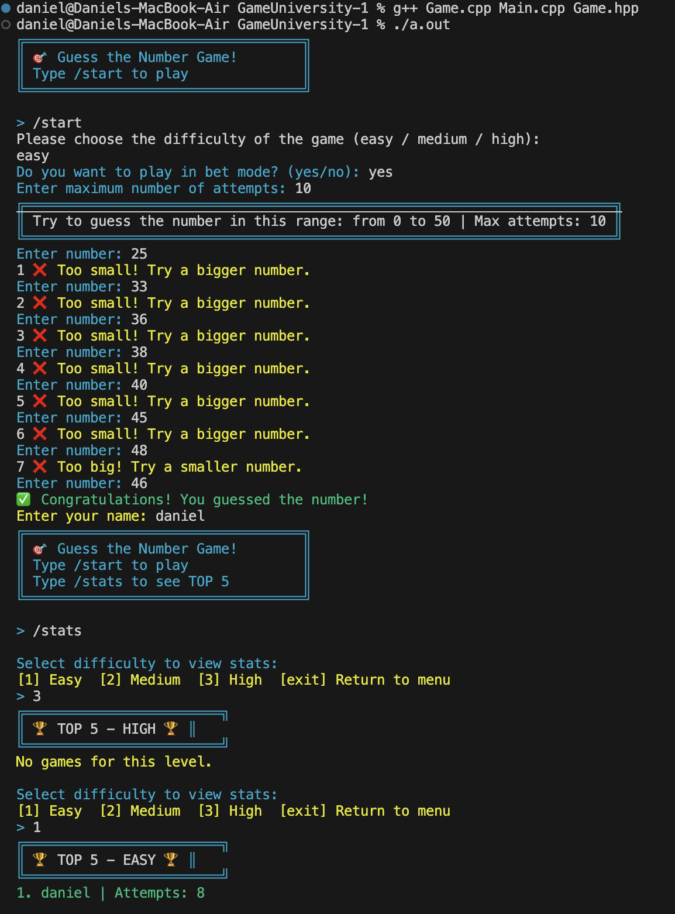

# 🎯 Guess The Number Game (C++)

## 📘 Description  
This is a console-based C++ game where the player tries to guess a secret number chosen by the program.  
The game allows you to select a difficulty level and keeps track of your last 5 games.

## 🕹️ How to Play  
1. When the program starts, you’ll see a welcome message.  
2. Type `/start` to begin the game or `/stats` to view your recent game stats.
3. You can choose bet mode for play with attempts limit
4. Choose the difficulty level:  
   - **easy** — range from 0 to 50  
   - **medium** — range from 0 to 100  
   - **high** — range from 0 to 250  
5. The program will generate a random secret number within the selected range.  
6. Keep guessing until you find the correct number.  
7. After each guess, you’ll be told whether your number is smaller or bigger than the secret one.  
8. When you win, the result (difficulty and attempts) is saved in your game history.

## 📊 Statistics  
The /stats command lets you choose a difficulty level and then displays the top 5 games for that level sorted by the fewest attempts.

## How to start a game?
You need to download latest release of game and then you need to open game.exe file
./GuessGame

